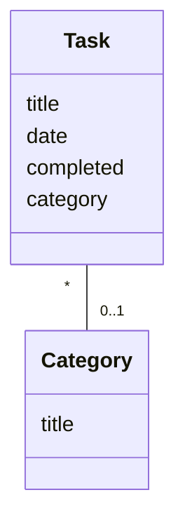
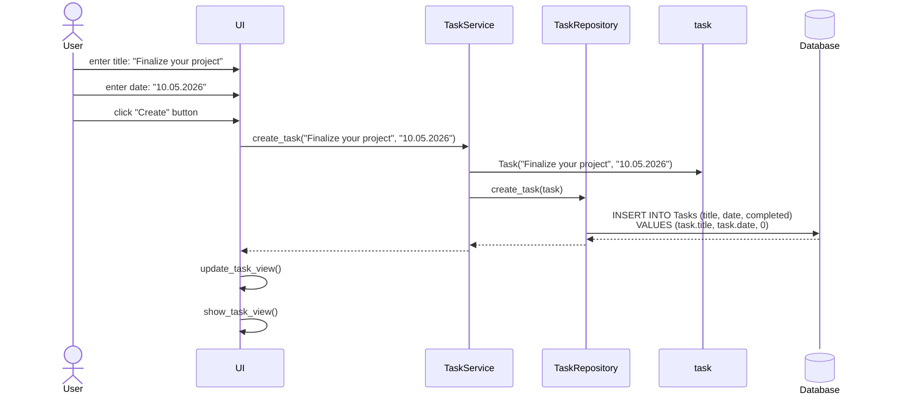
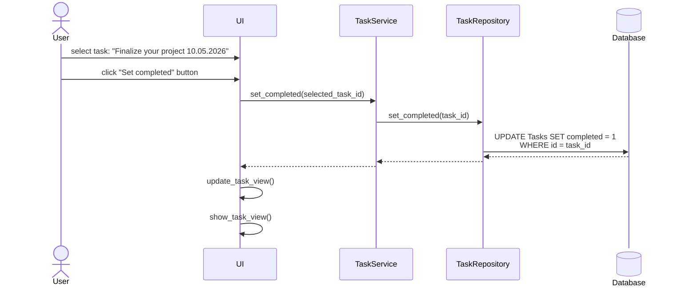

# Sovelluksen arkkitehtuuri

## Pakkauskaavio arkkitehtuurista
 

## Luokkakaaviot

Kuvaus `Task`-luokasta, jossa määritellään sovellukseen lisättävän tehtävän rakenne.
Kuvaus `Category`-luokasta, jossa määritellään sovellukseen lisättävän aihekategorian rakenne.

## Pakkauskaavio arkkitehtuurista luokilla

## Sovelluksen päätoiminnallisuudet

### Tehtävän lisääminen
Käyttäjä voi lisätä uuden tehtävän ollessaan sovelluksen päänäkymässä eli tehtävänäkymässä. Käyttäjä voi syöttää tekstikenttiin tehtävän kuvauksen ja määräajan ja lisätä uuden tehtävän painamalla "Create"-nappia. Oletuksena tehtävän tila on tekemätön. Tehtävän otsikko, määräaika ja tila tallennetaan SQL-tietokantatauluun. Lisätty tehtävä ilmestyy lopulta tehtävänäkymässä olevaan luetteloruutuun. Alla olevassa sekvenssikaaviossa on kuvattu sovelluksen toiminta pääpiirteittäin kyseisen käyttötapauksen osalta:

### Tehtävän merkitseminen tehdyksi
Käyttäjä voi merkitä tehtävän tehdyksi ollessaan sovelluksen päänäkymässä eli tehtävänäkymässä. Käyttäjä voi valita luetteloruudusta jonkin tekemättömän tehtävän ja merkitä sen tehdyksi painamalla "Set completed" -nappia. Tehtävän tilan muuttuminen tehdyksi päivitetään SQL-tietokantatauluun. Kyseinen tehtävä siirtyy tehtävänäkymässä toiseen luetteloruutuun, jossa on valmiiksi merkityt tehtävät. Alla olevassa sekvenssikaaviossa on kuvattu sovelluksen toiminta pääpiirteittäin kyseisen käyttötapauksen osalta: 

