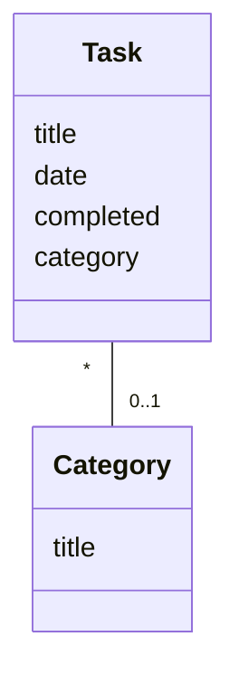
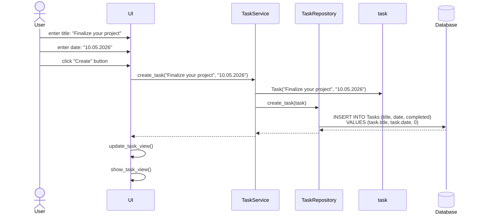
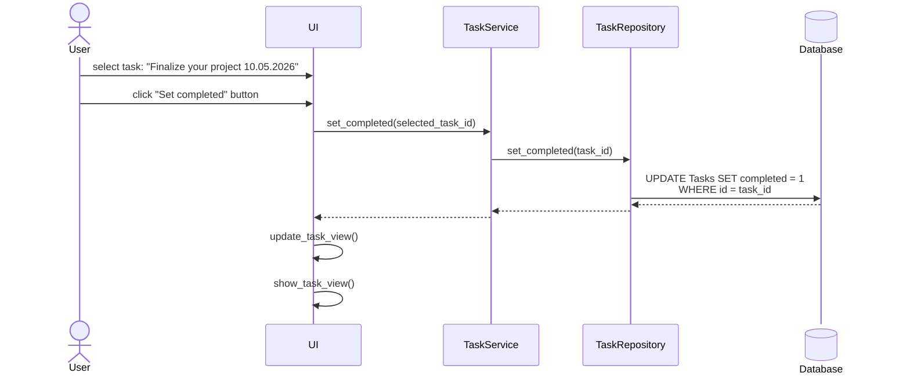

# Sovelluksen arkkitehtuuri

## Rakenne

Sovelluksen arkkitehtuurityylinä on käytetty kerrosarkkitehtuuria. Sovellus on jaettu kolmeen kerrokseen: Ylimmässä kerroksessa on käyttöliittymän koodi, toisessa kerroksessa on sovelluslogiikan koodi ja kolmannessa kerroksessa on tietojen tallennukseen liittyvä koodi.

Alla olevassa pakkauskaaviossa havainnollistetaan sovelluksen hakemistorakennetta sisältäen pakkaukset käyttöliittymästä *ui*, sovelluslogiikasta *services* ja tietojen tallennuksesta *repositories*. Lisäksi sovelluksen tietokohteet sisältyvät pakkaukseen *entities.*

 

## Käyttöliittymä

Sovelluksen käyttöliittymässä on kaksi näkymää: aloitusnäkymä ja tehtävänäkymä.

Tehtävänäkymä on sovelluksen päänäkymä, jonka kautta sovelluksen sisältämiä päätoimintoja voidaan käyttää.

Aloitusnäkymästä vastaa `StartView`-luokka. Tehtävänäkymä määritellään `TaskView`-luokassa. Eri näkymien näyttämisestä vastaa luokka `UI`.

## Sovelluslogiikka

Oheisessa luokkakaaviossa on kuvattu sovelluksen tietokohteita määrittävät luokat, niiden välinen suhde sekä luokkien sisältämät attribuutit. Luokassa `Task` määritellään sovellukseen lisättävien tehtävien rakenne ja luokassa `Category` kategorioiden rakenne. Yhteen tehtävään voi liittyä enintään yksi kategoria, mutta yksi kategoria voi liittyä useampaan tehtävään.

Luokasta `TaskService` muodostettavan olion tehtävänä on sovelluksen toiminnallisuudet, kuten tehtävien lisääminen, merkitseminen tehdyksi ja poistaminen.

Esimerkkejä TaskService-luokan metodeista, joita käyttöliittymän eri toiminnoissa käytetään:
* `create_task(title, date, category)`
* `set_completed(task_id)`
* `delete_task(task_id)`

Sovelluslogiikasta vastaava palvelu *TaskService* käsittelee tehtäviä ja kategorioita luokkien `TaskRepository` ja `CategoryRepository` avulla. Luokat sijaitsevat hakemistossa *repositories*.

## Tietojen tallennus

*Repositories* on tietojen tallennuksesta huolehtiva kerros. Luokka `TaskRepository` vastaa tehtävien tallentamisesta ja luokka `CategoryRepository` kategorioiden tallentamisesta. Molemmat luokat tallentavat tietoja SQLite-tietokantaan.

### Tiedostot

Sovellus tallentaa tehtäviä ja kategorioita SQLite-tietokantatauluihin. Tiedosto määritellään konfiguraatiotiedostossa ".env". Tehtävät tallennetaan tauluun `Tasks`, joka sisältää tehtävän `id`-numeron, tehtävän kuvauksen `title`, tehtävän tilan `completed` (0=tekemättä, 1 = tehty) sekä kategorian id-numeron `category_id`.

Kategoriat tallennetaan tauluun `Categories` sisältäen kategorian `id`-numeron ja kategorian kuvauksen `title`.

Taulussa `Tasks` jokaisen tehtävän kohdalla on viittaus tehtävän kategoriaan `category_id`:n kautta, mikäli tehtävään on lisätty tieto kategoriasta.

## Sovelluksen päätoiminnallisuudet

### Tehtävän lisääminen
Käyttäjä voi lisätä uuden tehtävän ollessaan sovelluksen päänäkymässä eli tehtävänäkymässä. Käyttäjä voi syöttää tekstikenttiin tehtävän kuvauksen ja määräajan ja lisätä uuden tehtävän painamalla "Create"-nappia. Oletuksena tehtävän tila on tekemätön. Tehtävän otsikko, määräaika ja tila tallennetaan SQL-tietokantatauluun. Lisätty tehtävä ilmestyy lopulta tehtävänäkymässä olevaan luetteloruutuun. Alla olevassa sekvenssikaaviossa on kuvattu sovelluksen toiminta pääpiirteittäin kyseisen käyttötapauksen osalta:

### Tehtävän merkitseminen tehdyksi
Käyttäjä voi merkitä tehtävän tehdyksi ollessaan sovelluksen päänäkymässä eli tehtävänäkymässä. Käyttäjä voi valita luetteloruudusta jonkin tekemättömän tehtävän ja merkitä sen tehdyksi painamalla "Set completed" -nappia. Tehtävän tilan muuttuminen tehdyksi päivitetään SQL-tietokantatauluun. Kyseinen tehtävä siirtyy tehtävänäkymässä toiseen luetteloruutuun, jossa on valmiiksi merkityt tehtävät. Alla olevassa sekvenssikaaviossa on kuvattu sovelluksen toiminta pääpiirteittäin kyseisen käyttötapauksen osalta: 

