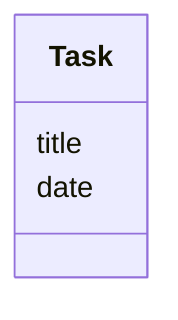

# Sovelluksen arkkitehtuuri

## Pakkauskaavio arkkitehtuurista
 

## Luokkakaavio

Kuvaus `Task`-luokasta, jossa määritellään sovellukseen lisättävän tehtävän rakenne.

## Pakkauskaavio arkkitehtuurista luokilla

