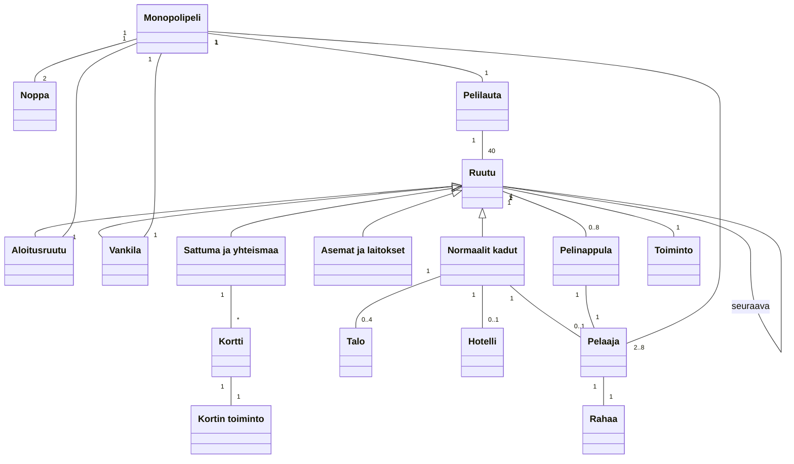

## Tehtävä 1: Luokkakaavio Monopoli-lautapelistä

```mermaid
 classDiagram
    Monopolipeli "1" -- "2" Noppa
    Monopolipeli "1" -- "1" Pelilauta
    Pelilauta "1" -- "40" Ruutu
    Ruutu "1" -- "1" Ruutu : seuraava
    
    Ruutu <|-- Aloitusruutu
    Ruutu <|-- Vankila
    Ruutu <|-- `Sattuma ja yhteismaa`
    Ruutu <|-- `Asemat ja laitokset`
    Ruutu <|-- `Normaalit kadut`
    
    Monopolipeli "1" -- "1" Aloitusruutu
    Monopolipeli "1" -- "1" Vankila
    
    Ruutu "1" -- "0..8" Pelinappula
    `Sattuma ja yhteismaa` "1" -- "*" Kortti
    Kortti "1" -- "1" `Kortin toiminto`
    `Normaalit kadut` "1" -- "0..4" Talo
    `Normaalit kadut` "1" -- "0..1" Hotelli
    `Normaalit kadut` "1" -- "0..1" Pelaaja
    Ruutu "1" -- "1" Toiminto
    Pelinappula "1" -- "1" Pelaaja
    Pelaaja "2..8" -- "1" Monopolipeli
    Pelaaja "1" -- "1" Rahaa
```
